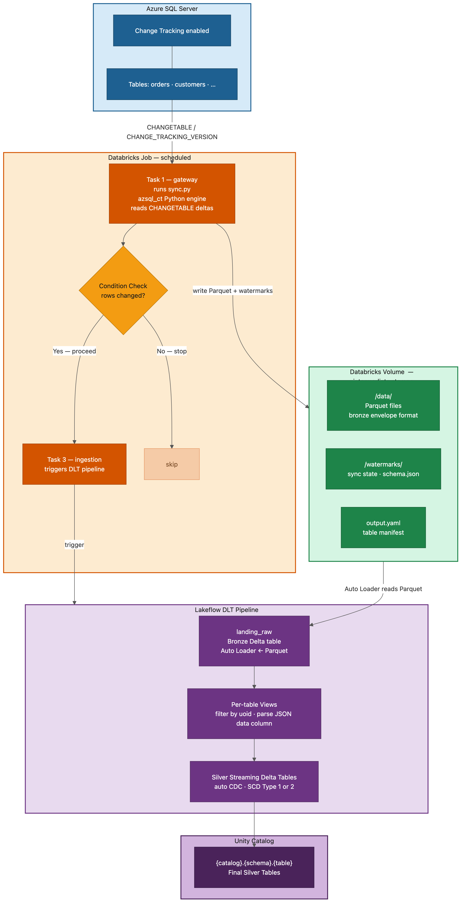

# Azure SQL → Databricks Incremental Sync

Automatically sync change-tracked tables from **Azure SQL Server** (or SQL Server on-prem) into **Databricks Unity Catalog** using SQL Server's native Change Tracking feature. Each run captures only what changed — inserts, updates, and deletes — and materializes them into Delta tables via Lakeflow DLT pipelines.

Uses [mssql-python](https://github.com/microsoft/mssql-python) — Microsoft's official driver with a built-in TDS layer, so **no system ODBC driver is needed**.

---

## How it works



**Two main components:**

| Component | What it does |
|-----------|-------------|
| `azsql_ct/` | Python package that connects to SQL Server, reads change deltas, and writes Parquet files to a Databricks Volume |
| `lakeflow_pipeline/` | Databricks DLT pipeline that reads those Parquet files and materializes them into Unity Catalog Delta tables |

A **Databricks Job** (generated by `dab/`) wires these together: the sync runs first, then triggers the DLT pipeline only if rows changed.

---

## Prerequisites

Before you start, make sure you have:

**SQL Server side**
- Change tracking enabled on the database and each table you want to sync (see [Enable change tracking](#enable-change-tracking) below)
- A SQL login with `VIEW CHANGE TRACKING` permission

**Databricks side**
- A Databricks workspace with Unity Catalog
- A Databricks Volume to store the Parquet output
- Databricks CLI installed and configured (`pip install databricks-cli`)

**Local development (optional)**
- Python 3.10+ (3.11 recommended)
- `pip install mssql-python pyarrow pyyaml`

---

## Getting started

### Step 1 — Enable change tracking on SQL Server

Run the following as a database admin. You only need to do this once per database and once per table:

```sql
-- Enable on the database (once per database)
ALTER DATABASE [my_database]
SET CHANGE_TRACKING = ON
(CHANGE_RETENTION = 2 DAYS, AUTO_CLEANUP = ON);

-- Enable on each table you want to sync
ALTER TABLE dbo.orders ENABLE CHANGE_TRACKING;
ALTER TABLE dbo.customers ENABLE CHANGE_TRACKING;

-- Grant permissions to the sync user
GRANT VIEW CHANGE TRACKING ON SCHEMA::dbo TO [sync_user];
```

> **Tip:** `CHANGE_RETENTION = 2 DAYS` means SQL Server keeps 2 days of change history. If the sync job doesn't run for longer than the retention period, it falls back to a full reload automatically.

### Step 2 — Create a pipeline config

Each SQL Server connection gets its own YAML config file under `pipelines/`. Start from the example template:

```bash
cp example_pipelines/pipeline_1.yaml pipelines/my_server.yaml
```

Then open `pipelines/my_server.yaml` and fill in the placeholders:

```yaml
connection:
  server: my-server.database.windows.net
  sql_login: sync_user
  password: ${ADMIN_PASSWORD}          # from .env file or environment variable

external_access: false                 # set true to generate Iceberg-compatible tables
parallelism: 4                         # tables synced in parallel

storage:
  ingest_pipeline: /Volumes/my_catalog/my_schema/my_volume/my_server

databases:
  my_database:
    uc_catalog: my_catalog             # Unity Catalog name for the silver tables
    schemas:
      dbo:
        uc_schema: my_schema           # Unity Catalog schema for the silver tables
        tables:
          orders:
            mode: full_incremental
            scd_type: 1
          customers:
            mode: full_incremental
            scd_type: 2               # SCD Type 2 — keep full history of row changes
```

> The `pipelines/` directory is gitignored since configs contain connection info. The `example_pipelines/` templates are safe to commit.

**Storing credentials securely:** Instead of environment variables, you can reference Databricks secrets directly in the YAML:

```yaml
connection:
  password: "{{secrets/my-scope/sql-password}}"
```

Set up a secret scope once with the Databricks CLI:
```bash
databricks secrets create-scope my-scope
databricks secrets put-secret --json '{"scope": "my-scope", "key": "sql-password", "string_value": "<password>"}'
```

### Step 3 — Configure the Databricks Asset Bundle

Open `dab/databricks.yml` and set `workspace_root` to the full workspace path where this repo lives. Review the remaining variables and adjust for your environment:

| Variable | Description |
|----------|-------------|
| `workspace_root` | Full workspace path to this repo (e.g. `/Workspace/Repos/my-org/databricks-sql-server-ingest`) |
| `catalog` | Unity Catalog name for the DLT pipelines |
| `manifest_file` | `incremental_output.yaml` (default, only processes changed tables) or `output.yaml` (all tables) |
| `pipeline_channel` | `CURRENT` (stable) or `PREVIEW` (early access features) |
| `event_log_catalog` | Unity Catalog catalog for pipeline event logs |
| `event_log_schema` | Unity Catalog schema for pipeline event logs |

The `dev` and `prod` targets override these defaults — update both to match your workspace.

### Step 4 — Generate the Databricks Asset Bundle resources

The `dab/` directory contains a [Databricks Asset Bundle](https://docs.databricks.com/dev-tools/bundles/index.html) that deploys one DLT pipeline + one job per pipeline config. After creating (or modifying) a config in `pipelines/`, regenerate the bundle resources:

```bash
python dab/generate_jobs.py
```

This writes two files per config (do not edit these by hand — they're regenerated each time):

| Generated file | What it does |
|----------------|-------------|
| `dab/resources/pipelines/sdp_my_server.yml` | DLT pipeline definition |
| `dab/resources/jobs/job_my_server.yml` | Job that runs the sync then triggers the DLT pipeline |

The job has this task flow:

```
gateway (runs sync.py)
  ├── check_record_changed  ──→  ingestion (DLT pipeline)  [only if rows changed]
  └── schema_change_detected                                [for alerting/branching]
```

### Step 5 — Deploy the bundle

Deploy from inside the `dab/` directory:

```bash
cd dab

# Validate first
databricks bundle validate -t dev

# Deploy to dev
databricks bundle deploy -t dev \
  --var workspace_root=/Workspace/Repos/my-org/databricks-sql-server-ingest

# Deploy to prod
databricks bundle deploy -t prod \
  --var workspace_root=/Workspace/Repos/my-org/databricks-sql-server-ingest
```

Once deployed, run the job from the Databricks UI or CLI. On first run it does a full load; subsequent runs are incremental.

> **Workspace deployment:** You can also deploy and manage bundles directly from the Databricks workspace UI — no local CLI required. Clone this repo into a Git folder and Databricks will recognise the `databricks.yml` at the root. See [Collaborate on bundles in the workspace](https://docs.databricks.com/aws/en/dev-tools/bundles/workspace).

---

## End-to-end example

Adding a second SQL Server from scratch:

```bash
# 1. Create the config from the template
cp example_pipelines/pipeline_1.yaml pipelines/finance_db.yaml
# Edit pipelines/finance_db.yaml with your connection and table details

# 2. Generate the bundle resources
python dab/generate_jobs.py
# Wrote dab/resources/pipelines/sdp_finance_db.yml
# Wrote dab/resources/jobs/job_finance_db.yml

# 3. Deploy
cd dab
databricks bundle deploy -t dev \
  --var workspace_root=/Workspace/Repos/my-org/databricks-sql-server-ingest
```

---

## Running sync locally (for testing)

You can run the sync on your laptop without Databricks — useful for testing connectivity or a small table:

```bash
# Install dependencies
python3.11 -m pip install mssql-python pyarrow pyyaml

# Run (set PYTHONPATH so the local azsql_ct package is found)
PYTHONPATH=$(pwd) python3.11 scripts/sync.py pipelines/my_server.yaml
```

Or install as an editable package:

```bash
pip install -e .
azsql-ct --config pipelines/my_server.yaml
```

Output lands in the `ingest_pipeline` path you configured. For local runs this is typically a local directory (e.g. `./output/my_server`).

---

## Reference

### Sync modes

| Mode | Behaviour |
|------|-----------|
| `full` | Reload the entire table every run |
| `incremental` | Only fetch rows changed since the last watermark (requires a prior sync) |
| `full_incremental` | Full load on first run, incremental on subsequent runs *(default)* |

If a watermark is older than `CHANGE_TRACKING_MIN_VALID_VERSION()`, the engine automatically falls back to a full sync.

### Output formats

| Format | Description |
|--------|-------------|
| `per_table` *(default)* | One Parquet file per table with original columns plus CT metadata |
| `unified` | Bronze envelope schema: `data` (JSON), `table_id`, `cursor`, `extractionTimestamp`, `operation`, `schemaVersion`. Required for the Lakeflow DLT pipeline. |

### SCD types

| Type | Behaviour |
|------|-----------|
| SCD Type 1 *(default)* | Overwrite — latest value wins |
| SCD Type 2 | Historical tracking — preserves prior versions of a row |

### External access (Iceberg-compatible tables)

Set `external_access: true` in your pipeline config to make the silver streaming tables readable by Iceberg clients (Snowflake, Trino, Spark OSS, etc.) via Delta UniForm V3.

```yaml
external_access: true
```

When enabled, two things happen:

| Layer | Effect |
|-------|--------|
| DLT pipeline (Spark configs) | `spark.databricks.delta.uniform.iceberg.v3.enabled` and `spark.databricks.delta.dbiManagedIcebergTable.v3.enabled` are set to `true` |
| Silver streaming tables (table properties) | `delta.columnMapping.mode=name`, `delta.enableRowTracking=true`, `delta.enableIcebergCompatV3=true`, `delta.universalFormat.enabledFormats=iceberg` |

The flag defaults to `false` (standard Delta tables, no Iceberg metadata). Flipping it to `true` on an existing pipeline will apply the properties on the next DLT refresh — no data rewrite required.

### Full config reference

| Field | Required | Description |
|-------|----------|-------------|
| `connection.server` | Yes | SQL Server hostname |
| `connection.sql_login` | Yes | Login name |
| `connection.password` | Yes | Password (`${VAR}` env expansion or `{{secrets/scope/key}}` Databricks secrets) |
| `external_access` | No | `true` to enable UniForm Iceberg V3 on silver tables (default: `false`) |
| `parallelism` | No | Tables synced in parallel (default: 1) |
| `storage.ingest_pipeline` | Yes | Root path for data, watermarks, and output manifest |
| `storage.output_format` | No | `per_table` (default) or `unified` |
| `storage.parquet_compression` | No | `zstd` (default), `snappy`, `gzip`, `brotli`, `lz4`, or `none` |
| `databases.<db>.uc_catalog` | No | Unity Catalog name for downstream DLT silver tables |
| `databases.<db>.schemas.<s>.uc_schema` | No | Unity Catalog schema for downstream DLT silver tables |
| `tables.<t>.mode` | No | `full`, `incremental`, or `full_incremental` (default) |
| `tables.<t>.scd_type` | No | `1` (default, overwrite) or `2` (historical tracking) |
| `tables.<t>.soft_delete` | No | `true` to keep deleted rows with an `_is_deleted` flag |

### Output structure

After a sync run, the `ingest_pipeline` directory looks like this:

```
{ingest_pipeline}/
├── data/
│   └── {database}/{schema}/{table}/{YYYY-MM-DD}/
│       └── {schema}_{table}_{timestamp}_part{N}.parquet
├── watermarks/
│   └── {database}/{schema}/{table}/
│       ├── watermarks.json      ← current sync state
│       ├── sync_history.jsonl   ← append-only audit log
│       └── schema.json          ← column definitions for DLT from_json parsing
└── output.yaml                  ← manifest of all synced tables (read by DLT pipeline)
```

---

## Project structure

```
example_pipelines/      Template YAML configs (safe to commit)
pipelines/              Your pipeline configs (gitignored — contain credentials)
azsql_ct/               Core sync package (Python)
scripts/                Runnable entry points (sync.py, connect.py, parse_output.py)
lakeflow_pipeline/      Databricks DLT pipeline code
dab/                    Databricks Asset Bundle
  databricks.yml          Bundle definition, targets, variables
  generate_jobs.py        Generator: pipelines/ → DAB resources
  resources/
    pipelines/            Generated DLT pipeline resources (do not edit)
    jobs/                 Generated job resources (do not edit)
tests/                  Unit tests
```

---

## Troubleshooting

| Error | Fix |
|-------|-----|
| `ModuleNotFoundError: No module named 'mssql_python'` | Install with Python 3.10+: `python3.11 -m pip install mssql-python` |
| `ChangeTracker has no attribute 'from_config'` | Run with `PYTHONPATH` set to the project root |
| `FileNotFoundError: pipelines/pipeline_1.yaml` | Create a config from the template or pass an explicit path |
| `Table is not change-tracked` | Enable change tracking at both the database and table level (see Step 1) |
| Job skips the `ingestion` task | No rows changed in the last sync — this is expected behaviour, not an error |

---

## License

Private.